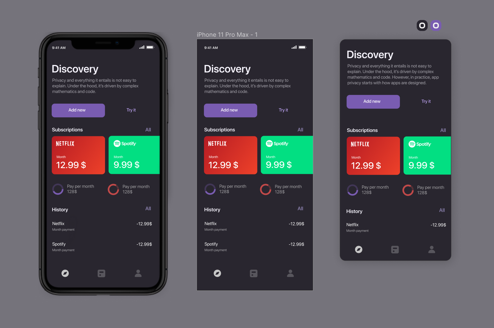

# Opencharge

[http://opencharge.tech](http://opencharge.tech)

«Ни один банковский сервис/платёжный сервис/кошелёк не готов к стремительно надвигающейся эпохе пост-потребления \(осмысленного потребления\), в которой процесс покупки идёт не от навязчивых предложений, а от первичного желания человека.»

