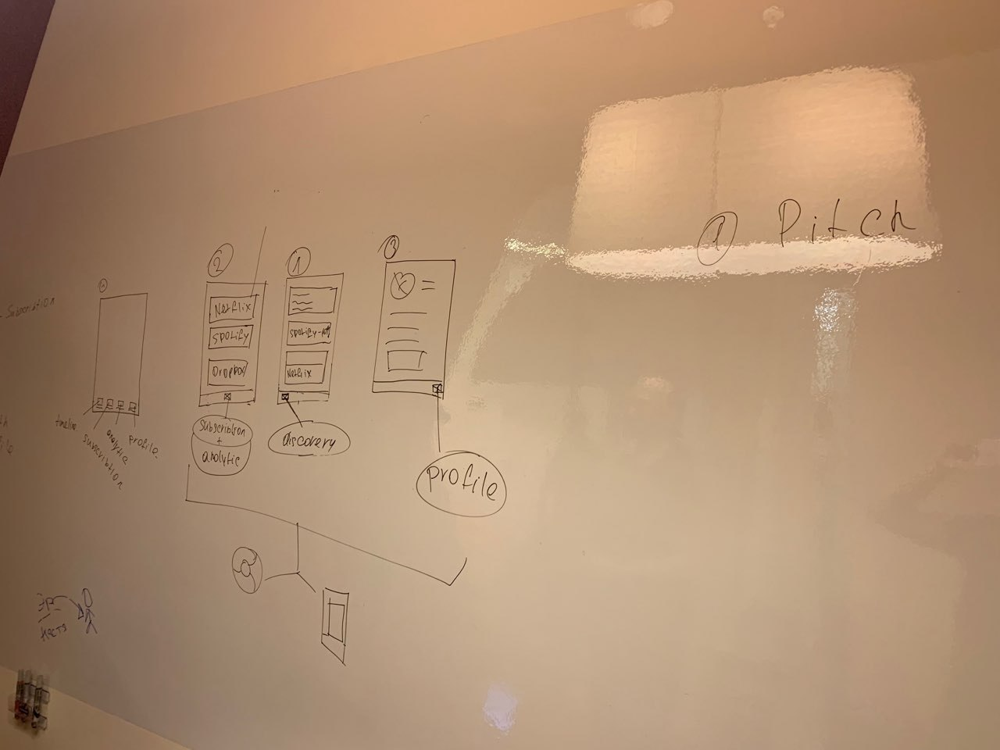

# Структура сервиса

### Подписки

* Превью снипеты \(название, период, цена, подробнее\)
* Подробности \(название / цена  / первый платёж / цикл списания длительность / валюта\)
* Добавить подписку \(название / цена  / первый платёж / цикл списания длительность / валюта\)

### Discovery

* Напоминание о предстоящем списании
* Собрана аналитика трат и экономии за месяц
* Подобран более подходящий тариф по подписке
* Предложение оформить подписку на Netflix перед выходом нового сезона.
* Предложение оформить подписку на музыку перед выходом нового альбома
* Предложение попробовать сервис по более выгодному тарифу
* Предложение приостановить подписку одного сервиса при оформлении подписки на сервис из аналогичной категории

#### Профиль

* Фото
* E-mail
* Пароль
* ФИО
* Телефон
* Адрес
* Привязанная карта

#### 

### Виртуальная почта

* Отслеживает входящие письма от подписочных сервисов;
* Отображает скидки/бонусы в приложениях \(браузер/мобила\) и таймлайе.

#### Аналитика

* Сэкономленные деньги за счёт оптимизации тарифов, замены сервисов с более дешёвым обслуживанием,
* Отображения получения сервиса лучшего качества за те же деньги за счёт персональных скидок

#### 

