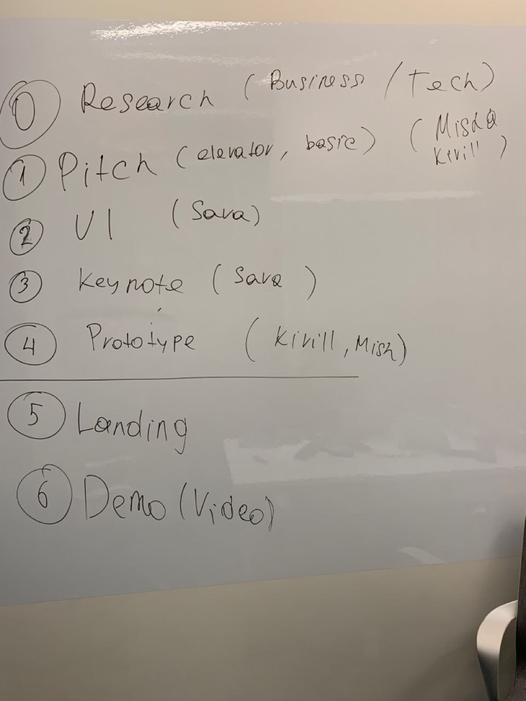

# План действий

### Этапы

#### 0 этап \(Трекер подписок\)

* Авторизация;
* Снипеты карточек сервисов под каждую категорию \(Музыка/Еда/Транспорт/Одежда/Аренда/…\);
* Режим добавления и редактирования подписки;
* Блок пользователя с настройками.

#### 1 этап \(Подписка на цифровые товары\)

* Chrome Extension, который в момент подписки предлагает оплатить виртуальной картой Opencharge и заводит подписку в приложение;
* Подписка, которая заводится в приложении и подставляет данные \(номер карты\) в браузере;
* Предлагает открыть подписку перед событием Netflix \(выходом фильма Игра пристолов\) / Яндекс Музыки перед релизом альбома.

#### 2 этап \(Скидка при покупке через Openchareg\)

* Оформление подписки на физическме товары с поиском скидки от Opencharge \(скидка по умолчанию + перебор купонов\)

#### 3 этап \(Сo-Branding + Opencharge\)

На основе аналитики частотных покупок выпуск Opencharge подписок на производственных мощностях сервисов по гайдам Opencharge

* Butnorton/OhMy/ + Opencharge
* Буше/Теремок/SuchiShop + Opencharge

#### Точки входа

* Подписка заведённая в момент оформления \(через браузерный плагин\)
* Подписка заведённая заранее в мобильном приложении \(со сгенерённой виртуалкой и лимитом\)

